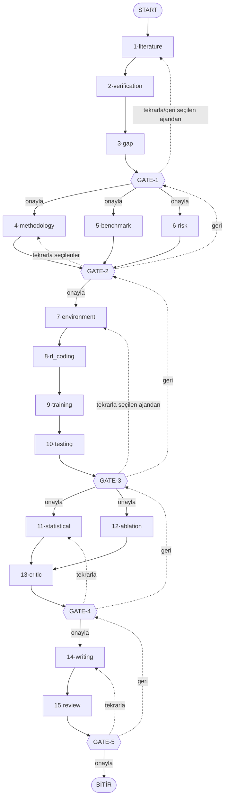

# Pipeline — Ajan Akışı ve Bağımlılıklar

15 ajan, 5 faz, 5 GATE (insan kontrol noktası). Bu dosya hangi ajanın kime bağlı
olduğunu, hangilerinin paralel çalıştığını ve GATE karar mekaniğini anlatır.

Kaynak: `workflow/graph.py`, `workflow/gates.py`, `workflow/common.py`, `workflow/nodes.py`.

---

## Araçlar — hangi ajan neye bağlı

`research_agents/tools.py` — 8 araç, hepsi ücretsiz ve API anahtarı gerektirmez.
**15 ajandan 12'si araçlı.**

| # | Ajan | Araçları | Aracın işi |
|---|------|----------|------------|
| 1 | Literature Search | `search_crossref` `search_arxiv` `citation_count` `search_github` | Gerçek makale bul; atıf sayısı; kod deposu |
| 2 | Verification | `crossref_lookup` `arxiv_lookup` | Her DOI/arXiv kimliğini bağımsızca teyit et |
| 3 | Research Gap | `search_crossref` `search_arxiv` | Boşluğu **aramayla kanıtla** (sonuç yok = gerçek açık) |
| 4 | Methodology Design | `search_crossref` `search_arxiv` | `literature_support` puanını gerçek kayda dayandır |
| 5 | Benchmark | `search_crossref` `search_arxiv` | Alanın gerçekten kullandığı baseline/metrikleri bul |
| 6 | Risk Analysis | `search_crossref` `search_arxiv` | Belgelenmiş başarısızlık modlarını bul |
| 7 | Environment | `search_github` | Önerilen simülatörün canlı deposu var mı |
| 8 | RL Coding | `search_github` | Referans uygulama var mı |
| 9 | Training | — | *Onaylanan yöntemi sentezler; dış olguya ihtiyacı yok* |
| 10 | Testing | — | *Faz-2'de onaylanan metriklere bağlı kalmalı (tasarım sınırı)* |
| 11 | Statistical Analysis | `describe_sample` `welch_t_test` | Ortalama/SD/%95 GA ve p-değerini **gerçekten hesapla** |
| 12 | Ablation Study | `describe_sample` `welch_t_test` | Bileşen deltalarını gerçekten hesapla |
| 13 | Scientific Critic | `search_crossref` `search_arxiv` | Çelişen/daha güçlü önceki çalışmayı bul |
| 14 | Writing | — | *Yeni bilgi eklememeli; yalnızca doğrulanmış girdiyi kullanır* |
| 15 | Scientific Review | `crossref_lookup` `arxiv_lookup` | Taslaktaki her atıfı yeniden doğrula |

### Araçların üç işlevi

**1 · Uydurmayı engellemek.** Araçsız ajan makaleyi hafızasından üretir — başlık makul
görünür ama DOI yoktur ya da sahtedir. Arama gerçek kayıt döndürür; doğrulama onları teyit
eder ve `status='bulunamadı'` olanları listeden çıkarır. Ajan #15 aynı denetimi taslaktaki
atıflar için tekrarlar, böylece uydurma atıf yayına gitmez.

**2 · Puanı ölçülebilir yapmak.** Şu puanlar artık tahmin değil: `citations`
(Semantic Scholar / Crossref), `repos` (GitHub yıldız), `literature_support` (arama isabeti),
boşluk `score`'u (aramanın sonuç döndürmemesi = gerçek açık).

**3 · Aritmetiği modelden almak.** `describe_sample` ve `welch_t_test` p-değerini, güven
aralığını ve Cohen's d'yi Python'da hesaplar. Ajan artık p-değeri uyduramaz: ham seed
değerleri yoksa "anlamlılık testi yapılamadı" demek zorunda.

> **Semantic Scholar uyarısı:** anahtarsız havuz sıkı oran sınırlıdır ve sık `429` döner
> (özellikle arXiv kimliklerinde). Araç hızlı başarısız olur ve ajan Crossref'in
> `atıf≈N` değerine düşer — talimatı gereği hangi kaynağı kullandığını gerekçesinde yazar.

---

## Ajan envanteri (numaralandırma arayüzdeki ile birebir aynı)

| # | Ajan | Node adı | Faz |
|---|------|----------|-----|
| 1 | Literature Search Agent | `literature` | Faz 1 · **araçlı** |
| 2 | Verification Agent | `verification` | Faz 1 · **araçlı** |
| 3 | Research Gap Agent | `gap` | Faz 1 · **araçlı** |
| 4 | Methodology Design Agent | `methodology` | Faz 2 · **araçlı** |
| 5 | Benchmark Agent | `benchmark` | Faz 2 · **araçlı** |
| 6 | Risk Analysis Agent | `risk` | Faz 2 · **araçlı** |
| 7 | Environment Agent | `environment` | Faz 3 · **araçlı** |
| 8 | RL Coding Agent | `rl_coding` | Faz 3 · **araçlı** |
| 9 | Training Agent | `training` | Faz 3 |
| 10 | Testing Agent | `testing` | Faz 3 |
| 11 | Statistical Analysis Agent | `statistical` | Faz 4 · **araçlı** |
| 12 | Ablation Study Agent | `ablation` | Faz 4 · **araçlı** |
| 13 | Scientific Critic Agent | `critic` | Faz 4 · **araçlı** |
| 14 | Writing Agent | `writing` | Faz 5 |
| 15 | Scientific Review Agent | `review` | Faz 5 · **araçlı** |

---

## Akış diyagramı

---

## Faz faz paralellik ve bağımlılıklar

### Faz 1 — tamamen ARDIŞIK (`literature → verification → gap`)
Her ajan bir öncekinin çıktısını mutasyona uğratıyor: `verification`, `literature`'ın
ürettiği `papers` listesine `verification` + `venue_score` + `final_score` ekliyor;
`gap`, doğrulanmış `papers`'a bakıp boşlukları çıkarıyor. Paralel çalışamaz çünkü her
adım bir öncekinin verisine yazıyor.

Doğrulama birleştirme kuralı (`nodes.py` · `verification_node`): ajandan yalnızca
`verification` + `venue_score` alınır ve `id` üzerinden orijinal kayda birleştirilir —
böylece Agent-1'in 5 metrik puanı ajan tarafından bozulamaz. `final_score` her zaman
Python tarafından `SCORE_WEIGHTS` ile deterministik hesaplanır.

### Faz 2 — TAM PARALEL (`methodology ∥ benchmark ∥ risk`)
Üçü de sadece `human_research_question`'a (GATE-1'de onaylanan soru) bakıyor,
birbirlerinin çıktısına ihtiyaç duymuyor → LangGraph'ta üçü aynı anda tetiklenip
hepsi bitince `gate2`'de birleşiyor (`graph.py:52-53`).

### Faz 3 — ARDIŞIK + Faz 2'ye GÜÇLÜ bağımlı (`environment → rl_coding → training → testing`)
- `environment` girdisi: `methodology_output` (Faz 2'nin tam metni) + soru.
- `rl_coding` girdisi: yine `methodology_output` (hangi algoritma onaylandıysa ona göre kod planı).
- `training` girdisi: soru + `methodology_output` + `rl_coding_output` + `environment_output`.
- `testing`: `benchmark_output`'a bakıyor (Faz 2'de onaylanan metriklerle uyumlu değerlendirme protokolü kurmak için).

GATE-3 arayüzünde her ajan kartının altında "(Phase-2 yöntemine bağlı)" notu bu
yüzden var — Faz 3'ün 4 ajanının 3'ü doğrudan `methodology_output`'a, biri de
`benchmark_output`'a bağımlı.

Ekstra mekanizma: `phase3_run` sayacı (`nodes.py:249`) her Faz-3 turunda artıyor ve
mock varyantları (`_SIMS`, `_TERRAINS`, `_REWARDS`, `_LRS`, `_SEEDS`...) `run % 3` ile
seçiliyor — yani "tekrarla" dediğinde gerçek yeniden-çalışma hissi vermek için her
turda farklı mock çıktı geliyor.

### Faz 4 — KARMA: `[statistical ∥ ablation] → critic`
`statistical` ve `ablation` paralel çalışıyor, ikisi de `training_results`'a
(GATE-3'te insanın girdiği gerçek deney sonucu notuna) bakıyor; ayrıca `statistical`
değerlendirme protokolünü, `ablation` ise yöntemin bileşen listesini alıyor.
`critic` ikisi bitince tetikleniyor, `statistical_output` + `ablation_output` +
Faz-2 risk listesini birlikte okuyor — critic her zaman ikisinin ARDINDAN gelen
tek bir node, asla paralel değil.

### Faz 5 — tamamen ARDIŞIK (`writing → review`)
`writing` girdisi: araştırma sorusu + doğrulanmış literatür (Related Work için) +
yöntem + protokol + istatistik + ablation + critic itirazları (overclaim'i önlemek için).
`review` sadece `writing_output`'u okuyup hakem raporu çıkarıyor.

---

## GATE karar mekaniği (onayla / tekrarla / geri)

Her GATE üç aksiyon sunuyor:

- **onayla** → bir sonraki faza geç (GATE-3'te ayrıca insan `training_results`
  notunu girmek zorunda — gerçek deney sonucu buradan Faz-4'e akıyor).
- **geri** → bir önceki GATE'e dön (GATE-1'de yok, çünkü öncesi yok).
- **tekrarla** → hangi ajan(lar) seçildiyse ona göre değişen bir kural var
  (`common.py:121-137`, `repeat_entry`):
  - **Ardışık fazlarda** (gate1, gate3, gate5): seçilen ajanların EN ERKENİ baz
    alınır, zincirin geri kalanı otomatik yeniden akar (örn. GATE-3'te sadece
    "Training Agent"ı seçersen, `training → testing` tekrar çalışır ama
    `environment`/`rl_coding` çalışmaz).
  - **Paralel fazda** (gate2): seçilen ajanların SADECE o alt kümesi yeniden
    çalışır, diğerleri dokunulmadan kalır.
  - **Karma fazda** (gate4): `statistical`/`ablation` seçilirse onlar (ve otomatik
    olarak `critic` sonrasında yeniden tetiklenir); hiçbiri seçilmeyip sadece
    `critic` seçilirse direkt `critic` yeniden çalışır.
  - Hiç ajan seçilmezse (checkbox boş): tüm faz baştan çalışır.

---

## State alanları (kim yazıyor, kim okuyor)

| State alanı | Yazan node | Okuyan node(lar) |
|---|---|---|
| `papers` | literature, verification | verification, gap, GATE-1 UI |
| `gaps` | gap | GATE-1 UI |
| `human_research_question` | GATE-1 (onayla) | methodology, benchmark, risk |
| `methodology_output` | methodology | environment, rl_coding |
| `benchmark_output` | benchmark | testing |
| `risk_output` | risk | — (sadece GATE-2 UI) |
| `training_results` | GATE-3 (onayla notu) | statistical, ablation |
| `statistical_output` | statistical | critic, writing |
| `ablation_output` | ablation | critic, writing |
| `writing_output` | writing | review |
| `critic_output` | critic | writing |
| `phase3_run` | environment | environment/rl_coding/training/testing (varyant seçimi) |

---

## Gerçek mod (API) dayanıklılığı

Bir tam tur 15 ardışık API çağrısı yapar; tek bir geçici hata turu düşürmemeli:

- **API yeniden deneme** (`common.py` · `_run_with_retry`): bağlantı/zaman aşımı/oran
  sınırı hatalarında artan beklemeyle 3 kez denenir. Uçtan uca testlerde bu mekanizma
  gerçekten devreye girdi ve turu kurtardı.
- **HTTP yeniden deneme** (`tools.py` · `_get`): Crossref/arXiv 5xx ve 429 yanıtlarında
  tekrar dener; kalıcı hatada araç `HATA: ...` döndürür (ajan bunu "kontrol edilemedi"
  olarak raporlar, "sahte kaynak" olarak değil).
- **JSON şekil normalizasyonu** (`common.py` · `normalize_list`): ajanlar bazen düz liste
  yerine `{"gaps": [...]}` gibi sarmalanmış JSON döndürür; bu otomatik açılır.
- **Görüntüleme güvenliği** (`app.py` · `_txt`, `_d`): model bir alanı liste/sözlük
  döndürürse arayüz çökmez, okunabilir metne çevrilir.
- **Puan hesabı** (`common.py` · `_score_of`): eksik metrik varsayılana düşer, çökmez.
