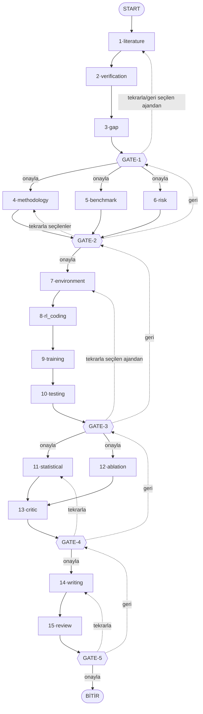

# Utonium — Agentic Research Workflow

RL tabanlı bacaklı robot araştırması için **insan kontrollü (human-in-the-loop)**
çok ajanlı araştırma workflow'u: **15 ajan · 5 faz · 5 insan kapısı (GATE)**.

> ### 🧪 Bu sayfa bir vitrin (demo)
> Buradaki kopya **MOCK modda** çalışır: ajanlar gerçek bir dil modeline gitmez,
> temsili çıktı üretir. Amaç akışı, GATE mekaniğini ve arayüzü göstermektir.
> Gerçek modeli çalıştırmak için aşağıdaki *Yerel kurulum* adımlarını izleyip
> kendi `OPENAI_API_KEY` anahtarını kullan.
>
> Ayrıca Spaces'te disk kalıcı değildir — uygulama uykuya daldığında demo
> projeleri sıfırlanır. Yerel kurulumda `data/checkpoints.db` kalıcıdır.

---

## Mimari karar

- **LangGraph** → workflow iskeleti: node'lar, GATE'ler (insan kontrolü), paralel
  dallar, state, kalıcılık.
- **OpenAI Agents SDK** → her node'un *içinde* çalışan ajan (`Agent` + `Runner`).
- **GATE'ler ajan değildir** → `interrupt()` çağıran ayrı LangGraph node'larıdır.
  İnsan, birinci sınıf bir karar düğümüdür.
- **Kalıcılık** → `SqliteSaver` ile `data/checkpoints.db`. Uygulama kapatılıp
  açılsa bile her proje kaldığı kapıdan devam eder.

## Akış



Her GATE'te üç seçenek var: **onayla** (ilerle), **tekrarla** (seçtiğin ajanları
yeniden çalıştır), **geri** (bir önceki kapıya dön). Ajanların ürettiği hiçbir şey
insan onayı olmadan bir sonraki faza geçmez.

## Ajanlar

| Faz | Ajanlar |
|-----|---------|
| 1 — Literatür | Literature Search · Verification · Research Gap |
| 2 — Tasarım (paralel) | Methodology Design · Benchmark · Risk Analysis |
| 3 — Uygulama | Environment · RL Coding · Training · Testing |
| 4 — Analiz | Statistical Analysis · Ablation Study · Scientific Critic |
| 5 — Yazım | Writing · Scientific Review |

12 ajan gerçek dış kaynaklara bağlı 8 araç kullanır: Crossref, arXiv ve GitHub
araması; Crossref/arXiv doğrulaması; Semantic Scholar atıf sayısı; betimsel
istatistik ve Welch t-testi. Ayrıntı: [`PIPELINE.md`](PIPELINE.md).

---

## Yerel kurulum (gerçek model)

```bash
git clone https://github.com/efekandlg0/15-agentic-workflow-research.git
cd 15-agentic-workflow-research

python3 -m venv .venv
source .venv/bin/activate          # Windows: .venv\Scripts\activate
pip install -r requirements.txt

cp .env.example .env               # içine kendi OPENAI_API_KEY'ini yaz
streamlit run app.py
```

`.env` yoksa uygulama **kendiliğinden MOCK moda düşer** — çökmez, kredi harcamaz.
Üstteki rozet hangi modda olduğunu gösterir.

Komut satırından çalıştırmak için: `python run.py`

### Masaüstü uygulaması olarak

```bash
bash launcher/build_mac_app.sh                                    # macOS → ~/Applications/Utonium.app
powershell -ExecutionPolicy Bypass -File launcher\kisayol_olustur.ps1   # Windows → masaüstü kısayolu
```

---

## Dokümanlar

| Dosya | İçerik |
|-------|--------|
| [`PIPELINE.md`](PIPELINE.md) | Ajan envanteri, araç bağımlılıkları, faz paralelliği, GATE mekaniği, state alanları |
| [`YAPI.md`](YAPI.md) | Dosya/paket yapısı — neyi değiştirmek için hangi dosyaya bakılır |
| [`KURULUM.md`](KURULUM.md) | Ayrıntılı kurulum adımları |

## Notlar

- Yerel paket adı `research_agents/` — `agents/` OpenAI kütüphanesine ait, çakışırdı.
- `interrupt()` çağrısını **asla** `try/except` içine sarma; grafik düzgün duraklamaz.
  Node interrupt sonrası baştan çalışır, o yüzden interrupt'tan önce ağır iş yapma.
- Checkpointer olmadan `interrupt()` çalışmaz — `compile(checkpointer=...)` şart.
